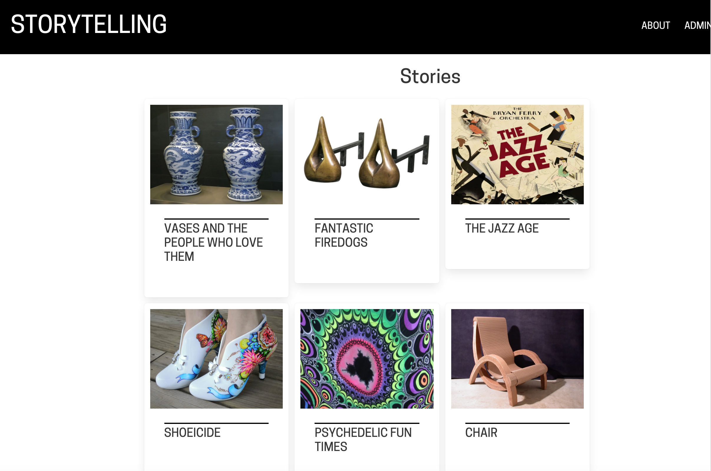

# Project Troubadour: A Storytelling Platform

Created in conjunction with Microsoft and the Smithsonian's Cooper Hewitt Museum of Design

Visit the prototype [here](https://aka.ms/troubadour)

## A storytelling platform for museums, archives and libraries.

The frontend application code is kept in `app` and the backend database connection is in `api`. 

The frontend is created with Vue.js and the backend consists of serverless JavaScript functions connecting to a CosmosDB no-sql database.

This application features both a frontend for viewing stories curated via the platform and the backend to create the stories themselves.

## Features

- Create a story with or without a cover image
  
  - Create an open ended story via search
  - Create a story with a title and a top-down narrative

- Add items from several collections via Search (currently the project is connected to the Cooper Hewitt's API and the Victoria and Albert's API)
  
- Add metadata to stories by adding text, video embeds, tweets, or even formatted blogposts.

- Drag and drop story items into a grid format (prototype only) to create your web project.

- Deploy your website as a new Static Web App (prototype only)

- Collaborate with other users (prototype only)

## Running locally

You will need to have your local machine set up with Node and NPM. To run your own version of this software with its own backend, create a [CosmosDB](https://docs.microsoft.com/azure/cosmos-db/introduction?WT.mc_id=academic-8734-jelooper) database and add its query string into a `/api/local.settings.json` file. 

Since this app is written as an Azure Static Web App with authentication, you can run as an authenticated user via Wassim Chegham's 'SWA' application, which you can install [following the instructions here](https://github.com/manekinekko/swa-emulator).

To run, open a terminal (for example in Visual Studio Code) `cd` to the `app` folder `npm run serve` then in a new terminal type: `swa --use-dev-server "http://localhost:8080"`. Your app will run its frontend on port 8080 and backend on 7071. 
